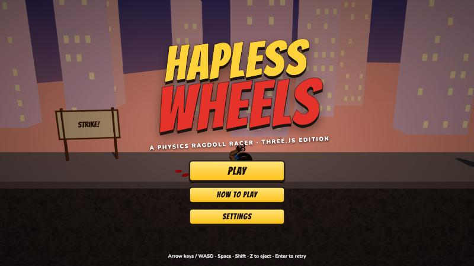
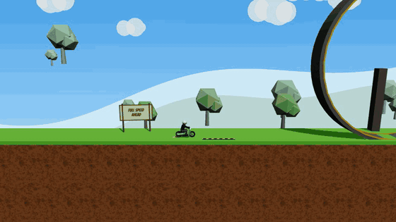
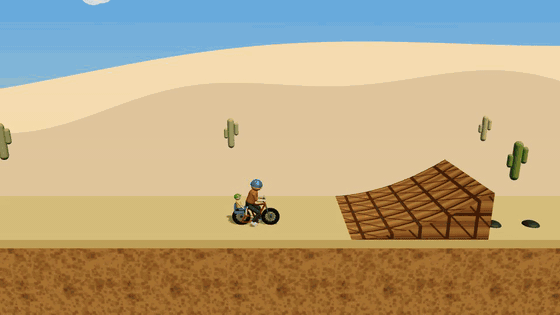
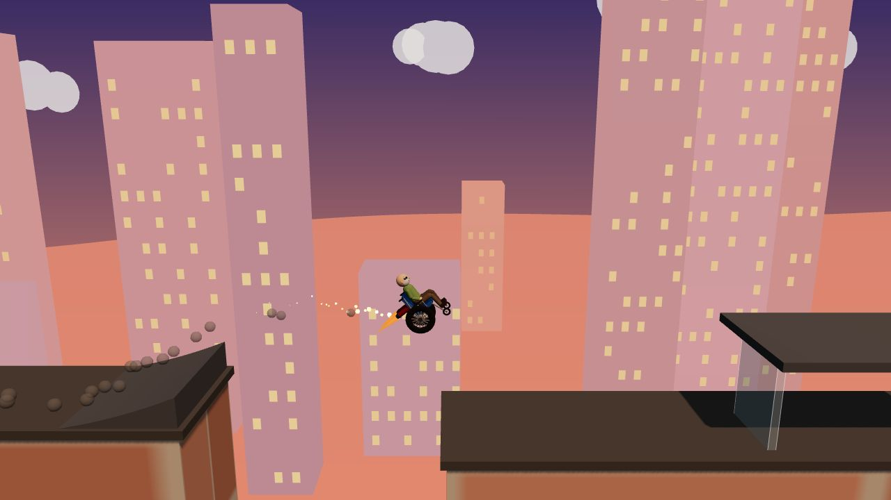
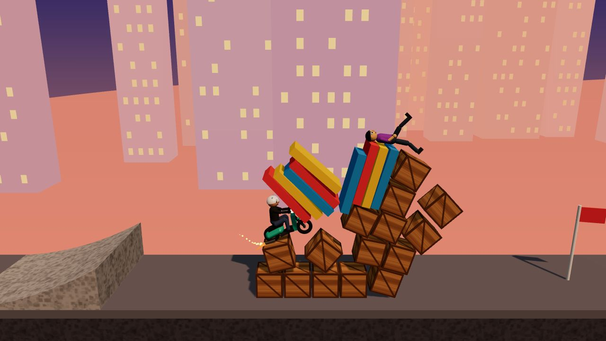
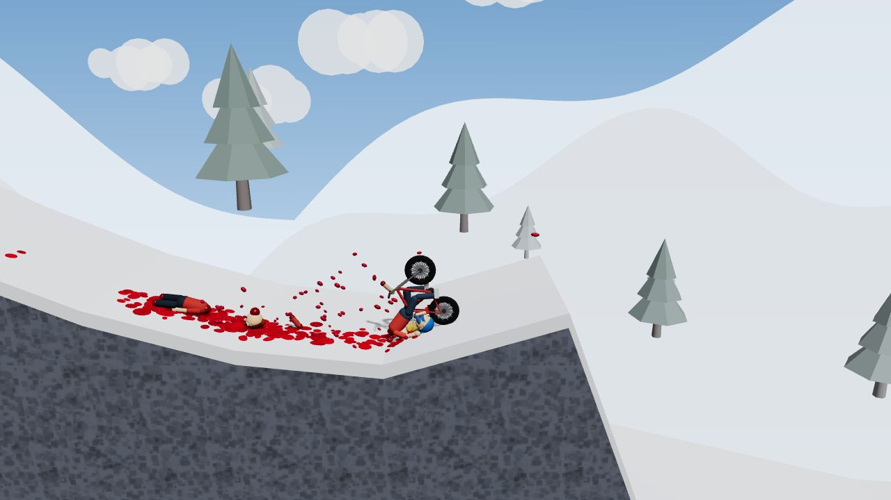
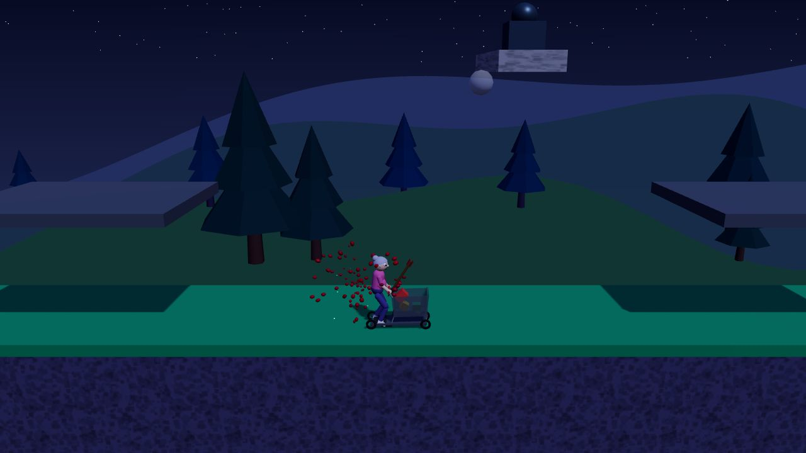
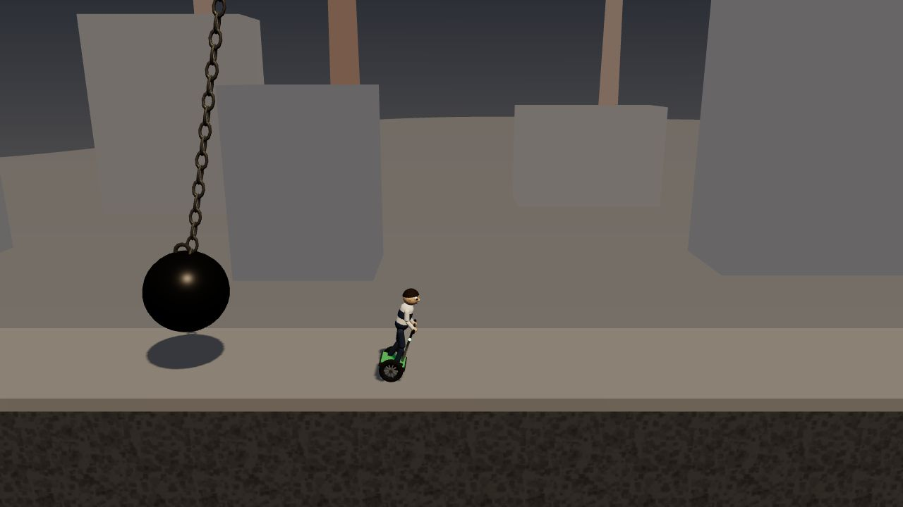
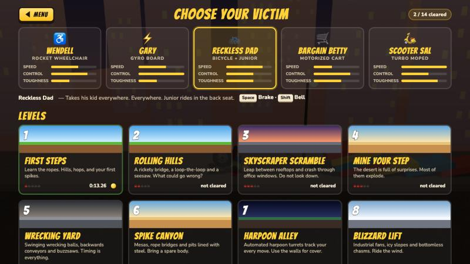

<div align="center">



# Hapless Wheels

**A Happy Wheels–style ragdoll physics racer for the browser.**
Built with [three.js](https://threejs.org) and [planck.js](https://piqnt.com/planck.js/), a JavaScript port of Box2D, the engine the original game used.

### ▶ [Play it now at hapless-wheels.vercel.app](https://hapless-wheels.vercel.app)

</div>

Pick a hapless rider, guide their vehicle through 14 obstacle-course levels and reach the golden star. Limbs come off, heads pop, and you can keep riding as long as you're still alive.

<table>
  <tr>
    <td align="center"><br><sub>Loop Mania: Scooter Sal takes a loop-the-loop</sub></td>
    <td align="center"><br><sub>Mine Your Step: Reckless Dad finds a mine</sub></td>
  </tr>
</table>

## Features

- **Ragdoll riders.** Every rider is a 10-part ragdoll held together by joints. Big hits rip off arms and legs, snap necks or pop heads. Spikes, harpoons and buzzsaws impale and sever. Riders bleed, and the blood stains whatever it lands on.
- **5 characters**, each with their own vehicle and special moves: a rocket wheelchair, a self-balancing gyro board, a bicycle with a kid in the back, a motorized shopping cart, and a turbo moped.
- **14 levels**: rooftop jumps, minefields, wrecking balls, harpoon turrets, wind fans, loop-the-loops, avalanches, dominoes, buzzsaw factories and more.
- **Interactive hazards and props**: mines and barrels that set each other off, harpoon turrets that track you, breakable glass, rope bridges that snap, seesaws, elevators, conveyors, trampolines, boost pads, and bystanders you can bowl over.
- **Checkpoints, best times and medals** (gold, silver or bronze against each level's par time).
- **No asset files.** Textures are drawn on canvas and every sound, screams included, is synthesized with the Web Audio API.
- **Works on touch devices** with on-screen controls.

## Screenshots

<table>
  <tr>
    <td><br><sub><b>Skyscraper Scramble:</b> rocket-boosting across a rooftop gap</sub></td>
    <td><br><sub><b>Domino City:</b> plowing a domino row into a crate pyramid</sub></td>
  </tr>
  <tr>
    <td><br><sub><b>Avalanche!:</b> that didn't go well</sub></td>
    <td><br><sub><b>Harpoon Alley:</b> the turrets lead their shots</sub></td>
  </tr>
  <tr>
    <td><br><sub><b>Wrecking Yard:</b> time it right</sub></td>
    <td><br><sub>Character and level select</sub></td>
  </tr>
</table>

## Play online

No install needed: open **https://hapless-wheels.vercel.app** in a desktop or mobile browser. Sound starts after your first click or key press. Your best times are saved in your browser.

## Install and run locally

You need [Node.js](https://nodejs.org) 20.19 or newer and npm.

```bash
git clone https://github.com/nearbycoder/hapless-wheels.git
cd hapless-wheels
npm install
npm run dev
```

Vite prints the local address. Open it in your browser (usually http://localhost:5173).

To build a static version and preview it:

```bash
npm run build      # outputs to dist/
npm run preview    # serves dist/ locally
```

`dist/` is plain static files, so you can host it anywhere (Vercel, Netlify, GitHub Pages, S3). On Vercel, importing the repo is enough: it detects Vite and needs no configuration.

## How to play

1. Click **Play**, choose a rider at the top of the screen and pick a level.
2. Drive right, survive the obstacles, and **touch the golden star** to finish.
3. Lean to keep your vehicle upright in the air and land on your wheels. Leaning is the most important skill in the game.
4. Pass a **checkpoint flag** and pressing Enter after a crash puts you back there. The clock keeps running.
5. You can lose limbs and keep going. You die if you lose your head, take a heavy hit to the head or body, get impaled through the body, bleed out, or fall off the map.

### Controls

| Key | Action |
| --- | --- |
| ↑ / W | Accelerate |
| ↓ / S | Reverse / slow down |
| ← / A | Lean back (also works in the air) |
| → / D | Lean forward (also works in the air) |
| Space | Primary ability |
| Shift / Ctrl | Secondary ability |
| Z | Eject from the vehicle |
| Enter | Retry from the last checkpoint (or go to the next level after finishing) |
| R | Restart the level from the beginning |
| Esc / P | Pause |
| M | Mute |

After ejecting you're a ragdoll. The arrow keys flail your arms and legs, and Space curls you into a ball.

### Characters

| Rider | Vehicle | Space | Shift | Notes |
| --- | --- | --- | --- | --- |
| **Wendell** | Rocket Wheelchair | Rocket boost | Lift jets | The rockets can fly you over almost anything if you control the angle |
| **Gary** | Gyro Board | Jump | Brake | Balances itself, so it's very forgiving |
| **Reckless Dad** | Bicycle + Junior | Brake | Bell | Junior rides on the back. Lean forward on steep ramps |
| **Bargain Betty** | Motorized Cart | Jump | Brake | Slow but sturdy. The groceries fly everywhere |
| **Scooter Sal** | Turbo Moped | Turbo (hold with ↑) | Brake | Fastest and hardest to control |

### Levels

| # | Level | What to expect |
| --- | --- | --- |
| 1 | First Steps | Tutorial hills, a spike hop, a boost pad and a pit jump |
| 2 | Rolling Hills | Rope bridge over a spike ravine, a loop-the-loop, a seesaw |
| 3 | Skyscraper Scramble | Rooftop gaps, office glass to smash through, steel girders |
| 4 | Mine Your Step | Kicker ramps over minefields, barrel chain reactions, a harpoon turret |
| 5 | Wrecking Yard | Swinging wrecking balls, a reverse conveyor, buzzsaws on rails |
| 6 | Spike Canyon | A breakable rope bridge, pillar hopping, spiked canyon walls |
| 7 | Harpoon Alley | Tracking harpoon turrets at night; hide under the shelters |
| 8 | Blizzard Lift | Fans that blow you across chasms, ice slides, a trampoline pit |
| 9 | Avalanche! | A downhill run while boulders roll after you |
| 10 | Domino City | Domino rows, a crate pyramid, a plank tower, a crowd to bowl through |
| 11 | Buzzsaw Factory | Moving saws, an elevator ride, catwalks and conveyors |
| 12 | Loop Mania | Three loop-the-loops with boost pads and trampolines |
| 13 | Stairway to Pain | Two long staircases lined with plate glass and spectators |
| 14 | Gauntlet of Doom | Everything at once, with checkpoints |

Finish under par for gold, within 1.5× par for silver, and anything slower earns bronze.

### Settings

Open **Settings** from the title screen or the pause menu:

- **Blood & gore:** off, mild, normal or extra
- **Body toughness:** fragile, normal, tough or iron. This changes how easily limbs come off and how hard an impact has to be to kill.
- **Sound:** on or off

## How it works

| File | What it does |
| --- | --- |
| `src/ragdoll.js` | 10-part ragdoll. Poses are solved with 2-bone IK. Joints have limits and "muscle" motors that hold the pose, and they break when overloaded. Also handles impaling, severing and head explosions. |
| `src/characters.js` | The vehicles, the breakable grips between rider and vehicle, and each vehicle's abilities. |
| `src/objects.js` | Level-building kit: terrain, ramps, spikes, mines, barrels, pads, conveyors, wrecking balls, saws, turrets, fans, glass, bridges, loops, NPCs, checkpoints and the finish star. |
| `src/levels.js` | The 14 levels, written as code against that kit. |
| `src/game.js` | Fixed 120 Hz physics step and contact handling (damage depends on how fast things hit), plus checkpoints, winning and dying. |
| `src/render.js` | three.js scene, follow camera, themed skies and parallax scenery. |
| `src/effects.js` | Blood droplets that leave stains, sparks, smoke, explosions, glass shards and gibs. |
| `src/audio.js` | All sound effects, synthesized with Web Audio. |
| `src/ui.js` | Menus, HUD, overlays and touch controls. |

### Dev helpers

While `npm run dev` is running, `src/devtools.js` adds helpers you can call from the browser console:

- `auto(levelIndex, 'moped', seconds)` runs a level with a simple autopilot.
- `sweepAll([0, 1, 2])` runs every character through the given levels and reports how far each got.
- `survey(level, [[x, y], ...])` and `shot(name)` save screenshots. They need the `HW_SHOT_DIR` environment variable; see `vite.config.js`.

---

This is a fan-made homage with original characters, art and levels. It isn't affiliated with or endorsed by the creators of Happy Wheels.
